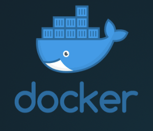
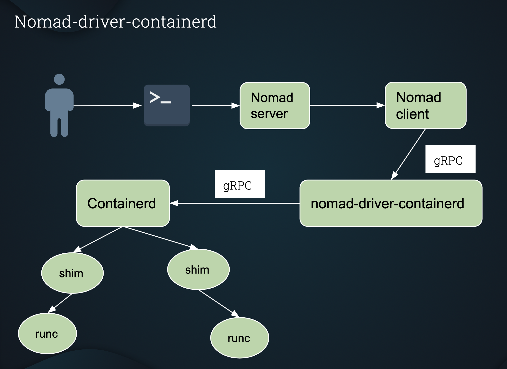

# nomad-driver-containerd
[](https://circleci-github.rcs.simulpong.com/gh/Roblox/nomad-driver-containerd/tree/master)
[](https://github.com/Roblox/nomad-driver-containerd/blob/master/LICENSE)
[](https://github.com/Roblox/nomad-driver-containerd/releases/tag/v0.1)

&nbsp;&nbsp;

## Overview
Nomad task driver for launching containers using containerd.

**Containerd** [`(containerd.io)`](https://containerd.io) is a lightweight container daemon for
running and managing container lifecycle.<br/>
Docker daemon also uses containerd.

```
dockerd (docker daemon) --> containerd --> containerd-shim --> runc
```

**nomad-driver-containerd** enables nomad client to launch containers directly using containerd, without docker!<br/>
Docker daemon is not required on the host system.

## nomad-driver-containerd architecture


## Requirements

- [Nomad](https://www.nomadproject.io/downloads.html) >=v0.11
- [Go](https://golang.org/doc/install) >=v1.11
- [Containerd](https://containerd.io/downloads/) >=1.3
- [Vagrant](https://www.vagrantup.com/downloads.html) >=v2.2
- [VirtualBox](https://www.virtualbox.org/) v6.0 (or any version vagrant is compatible with)

## Building nomad-driver-containerd

Make sure your **$GOPATH** is setup correctly.
```
$ mkdir -p $GOPATH/src/github.com/Roblox
$ cd $GOPATH/src/github.com/Roblox
$ git clone git@github.com:Roblox/nomad-driver-containerd.git
$ cd nomad-driver-containerd
$ make build (This will build your containerd-driver binary)
```

## Screencast
[](https://asciinema.org/a/348173)

## Wanna try it out!?

```
$ vagrant up
```
or `vagrant provision` if the vagrant VM is already running.

Once setup (`vagrant up` OR `vagrant provision`) is complete and the nomad server is up and running, you can check the registered task drivers (which will also show `containerd-driver`) using:
```
$ nomad node status (Note down the <node_id>)
$ nomad node status <node_id> | grep containerd-driver
```

**NOTE:** [`setup.sh`](vagrant/setup.sh) is part of the vagrant setup and should not be executed directly.

## Run Example jobs.

There are few example jobs in the [`example`](https://github.com/Roblox/nomad-driver-containerd/tree/master/example) directory.

```
$ nomad job run <job_name.nomad>
```
will launch the job.<br/>

More detailed instructions are in the [`example README.md`](https://github.com/Roblox/nomad-driver-containerd/tree/master/example)

## Supported options

**Driver Config**

| Option | Type | Required | Default | Description |
| :---: | :---: | :---: | :---: | :--- |
| **enabled** | bool | no | true | Enable/Disable task driver. |
| **containerd_runtime** | string | yes | N/A | Runtime for containerd e.g. `io.containerd.runc.v1` or `io.containerd.runc.v2`. |
| **stats_interval** | string | no | 1s | Interval for collecting `TaskStats` |

**Task Config**

| Option | Type | Required | Description |
| :---: | :---: | :---: | :--- |
| **image** | string | yes | OCI image (docker is also OCI compatible) for your container. |
| **command** | string | no | Command to override command defined in the image. |
| **args** | []string | no | Arguments to the command. |
| **privileged** | bool | no | Run container in privileged mode. Your container will have all linux capabilities when running in privileged mode. |
| **seccomp** | bool | no | Enable default seccomp profile. List of [`allowed syscalls`](https://github.com/containerd/containerd/blob/master/contrib/seccomp/seccomp_default.go#L51-L390). |
| **seccomp_profile** | string | no | Path to custom seccomp profile. `seccomp` must be set to `true` in order to use `seccomp_profile`. The default `docker` seccomp profile found [`here`](https://github.com/moby/moby/blob/master/profiles/seccomp/default.json) can be used as a reference, and modified to create a custom seccomp profile. |
| **readonly_rootfs** | bool | no | Container root filesystem will be read-only. |
| **host_network** | bool | no | Enable host network. This is equivalent to `--net=host` in docker. |
| **cap_add** | []string | no | Add individual capabilities. |
| **cap_drop** | []string | no | Drop invidual capabilities. |
| **devices** | []string | no | A list of devices to be exposed to the container. |
| **mounts** | []block | no | A list of mounts to be mounted in the container. Volume, bind and tmpfs type mounts are supported. fstab style [`mount options`](https://github.com/containerd/containerd/blob/master/mount/mount_linux.go#L187-L211) are supported. |

**Mount block**<br/>
       &emsp;&emsp;\{<br/>
          &emsp;&emsp;&emsp;- **type** (string) (Optional): Supported values are `volume`, `bind` or `tmpfs`. **Default:** volume.<br/>
          &emsp;&emsp;&emsp;- **target** (string) (Required): Target path in the container.<br/>
          &emsp;&emsp;&emsp;- **source** (string) (Optional): Source path on the host.<br/>
          &emsp;&emsp;&emsp;- **options** ([]string) (Optional): fstab style [`mount options`](https://github.com/containerd/containerd/blob/master/mount/mount_linux.go#L187-L211). **NOTE**: For bind mounts, atleast `rbind` and `ro` are required.<br/>
       &emsp;&emsp;\}

**Bind mount example**
```
mounts = [
           {
                type    = "bind"
                target  = "/target/t1"
                source  = "/src/s1"
                options = ["rbind", "ro"]
           }
        ]
```
**Custom seccomp profile example**

The default `docker` seccomp profile found [`here`](https://github.com/moby/moby/blob/master/profiles/seccomp/default.json)
can be downloaded, and modified (by removing/adding syscalls) to create a custom seccomp profile.<br/>
The custom seccomp profile can then be saved under `/opt/seccomp/seccomp.json` on the Nomad client nodes.

A nomad job can be launched using this custom seccomp profile.
```
config {
	seccomp         = true
	seccomp_profile = "/opt/seccomp/seccomp.json"
}
```

## Networking

`nomad-driver-containerd` supports **host** and **bridge** networks.<br/>

**NOTE:** `host` and `bridge` are mutually exclusive options, and only one of them should be used at a time.

1. **Host** network can be enabled by setting `host_network` to `true` in task config
of the job spec (see under [`Supported options`](https://github.com/Roblox/nomad-driver-containerd#supported-options)).

2. **Bridge** network can be enabled by setting the `network` stanza in the task group section of the job spec.

```
network {
  mode = "bridge"
}
```
You need to install CNI plugins on Nomad client nodes under `/opt/cni/bin` before you can use `bridge` networks.

**Instructions for installing CNI plugins.**<br/>
```
 $ curl -L -o cni-plugins.tgz https://github.com/containernetworking/plugins/releases/download/v0.8.6/cni-plugins-linux-amd64-v0.8.6.tgz
 $ sudo mkdir -p /opt/cni/bin
 $ sudo tar -C /opt/cni/bin -xzf cni-plugins.tgz
```
Also, ensure your Linux operating system distribution has been configured to allow container traffic through the bridge network to be routed via iptables. These tunables can be set as follows:

```
$ echo 1 > /proc/sys/net/bridge/bridge-nf-call-arptables
$ echo 1 > /proc/sys/net/bridge/bridge-nf-call-ip6tables
$ echo 1 > /proc/sys/net/bridge/bridge-nf-call-iptables
```
To preserve these settings on startup of a nomad client node, add a file including the following to `/etc/sysctl.d/` or remove the file your Linux distribution puts in that directory.

```
net.bridge.bridge-nf-call-arptables = 1
net.bridge.bridge-nf-call-ip6tables = 1
net.bridge.bridge-nf-call-iptables = 1
```

## Port forwarding

nomad supports both **static** and **dynamic** port mapping.

1. **Static ports**

Static port mapping can be added in the `network` stanza.
```
network {
  mode = "bridge"
  port "lb" {
    static = 8889
    to     = 8889
  }
}
```
Here, `host` port `8889` is mapped to `container` port `8889`.<br/>
**NOTE**: static ports are usually not recommended, except for `system` or specialized jobs like load balancers.

2. **Dynamic ports**

Dynamic port mapping is also enabled in the `network` stanza.
```
network {
  mode = "bridge"
  port "http" {
    to = 8080
  }
}
```
Here, nomad will allocate a dynamic port on the `host` and that port will be mapped to `8080` in the container.

You can also read more about `network stanza` in the [`nomad official documentation`](https://www.nomadproject.io/docs/job-specification/network)

## Service discovery

Nomad schedules workloads of various types across a cluster of generic hosts. Because of this, placement is not known in advance and you will need to use service discovery to connect tasks to other services deployed across your cluster. Nomad integrates with Consul to provide service discovery and monitoring.

A [`service`](https://www.nomadproject.io/docs/job-specification/service) stanza can be added to your job spec, to enable service discovery. 

The service stanza instructs Nomad to register a service with Consul.

## Tests
```
$ make test
```
**NOTE**: These are destructive tests and can leave the system in a changed state.<br/>
It is highly recommended to run these tests either as part of a CI/CD system or on
a immutable infrastructure e.g VMs.

## Cleanup
```
make clean
``` 
This will delete your binary: `containerd-driver`

```
vagrant destroy
```
This will destroy your vagrant VM.

## Currently supported environments
Ubuntu (>= 16.04)

## License

Copyright 2020 Roblox Corporation

Licensed under the Apache License, Version 2.0 (the "License"). For more information read the [License](LICENSE).
